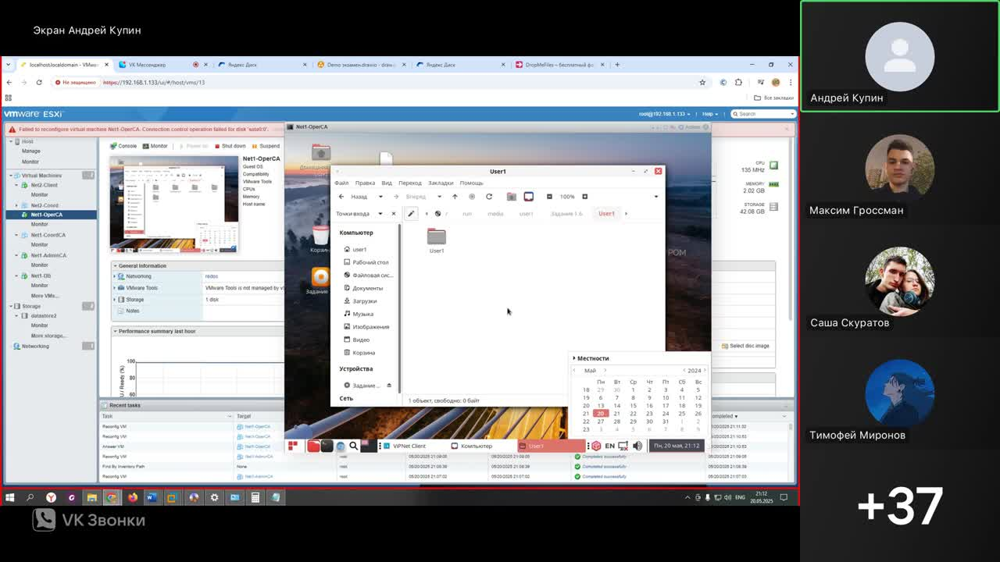

# Конспект видео
*Автоматически сгенерировано с помощью AI 03.06.2025*

Этот документ представляет собой автоматически сгенерированный конспект видео, созданный с использованием искусственного интеллекта. Конспект содержит ключевые моменты, важные концепции и скриншоты из видео.

## Содержание

- [Часть 1: 00:00:00.000 - 00:23:16.040](#часть-1)
- [Часть 2: 00:23:16.040 - 00:50:12.460](#часть-2)
- [Часть 3: 00:50:12.460 - 01:15:08.680](#часть-3)
- [Часть 4: 01:15:10.680 - 01:38:44.200](#часть-4)
- [Часть 5: 01:38:44.200 - 02:06:12.420](#часть-5)
- [Часть 6: 02:06:12.420 - 02:34:40.060](#часть-6)
- [Часть 7: 02:34:40.060 - 02:58:01.220](#часть-7)
- [Часть 8: 02:58:01.220 - 03:26:19.760](#часть-8)
- [Часть 9: 03:26:19.760 - 03:50:16.160](#часть-9)
- [Часть 10: 03:50:16.160 - 03:53:56.980](#часть-10)

## Часть 1
*Таймкод: 00:00:00.000 - 00:23:16.040*

# Конспект видео: Подготовка к демоэкзамену по VipNet

## Введение и организационные моменты

- **Ведущий:** Купин Андрей Владимирович
- **Тема:** Подготовка к демоэкзамену, разбор одного из вариантов задания, похожего на экзаменационный
- **Ссылки для подготовки:**
  - Яндекс.Диск: мануал по VipNet, администратор + IDS, образ VipNet for Linux, задание для подготовки
  - DropMeFiles: архив со всеми загрузочными файлами
- **Второй преподаватель:** Курчхидзе Георгий Викторович

---

## Состав ПО и образы для демоэкзамена

- **Образ demo.iso включает:**
  - AnyToISO — конвертация папок в ISO для загрузки ключей
  - VipNet Администратор — основное ПО для построения сети
  - VipNet SignForming — информационный компонент
  - VipNet Publication Service, Registration Point — лицензии отсутствуют, не рассматриваются
  - VipNet Клиент — создание VPN-сети
  - SQL Server — хранение базы данных VipNet
  - SQL Manager Studio — возможно понадобится для работы
- **Лицензия:** действует до 2024 года, дату на ПК нужно выставить соответствующую

**Важный момент для скриншота:**  
Показ структуры demo.iso и состава программ  
**Таймкод:** [00:03:00]


---

## Вопросы по доступу и методичке

- Все необходимые материалы доступны по предоставленным ссылкам
- Методичка и задание — по первой ссылке (Яндекс.Диск)
- Запись занятия ведётся

---

## Цифровая гигиена на экзамене

- **Что такое цифровая гигиена:**
  - Правила поведения за компьютером, за нарушение которых могут снизить баллы
- **Основные правила:**
  - При уходе/завершении экзамена — блокировать компьютер  
    - Windows: `Win + L`
    - RDoS: `Ctrl + Alt + L`
  - Организация рабочего места — порядок, отсутствие посторонних предметов, документы и пароли не должны быть на виду
  - По завершению экзамена — все выданные материалы собрать и убрать
  - После ухода — задвигать стул
  - При необходимости выйти — поднять руку, заблокировать ПК, задвинуть стул

**Важный момент для скриншота:**  
Пояснение по цифровой гигиене и демонстрация блокировки экрана  
**Таймкод:** [00:13:00]


---

## Введение в задание и топологию сети

- **Описание задания:**
  - Схема защищённой сети VipNet, аналогичная экзаменационной
  - Виртуальные машины:
    - net1-админца (центральный офис)
    - оперца
    - кордца (координатор/маршрутизатор)
- **Основные этапы построения защищённой сети VipNet:**
  1. **Установка компонентов:**
     - VipNet Координатор — основа защищённой сети, маршрутизация и шифрование
     - VipNet Клиенты (Windows/Linux) — на каждом ПК пользователя
     - VipNet Администратор — создание и управление топологией
     - Дополнительно: VipNet SafeDisk, IDS, Firewall (в данном задании не используются)
  2. **Создание топологии защищённой сети:**
     - В администраторе создаются виртуальные узлы (host'ы), объединяются в группы безопасности, настраиваются маршрутизация и доверие, назначаются координаторы
  3. **Выпуск ключей:**
     - Создание ключей через удостоверяющий ключевой центр (УКЦ)
  4. **Установка ключей на клиентские машины**
  5. **Тестирование сети**

**Важный момент для скриншота:**  
Схема топологии сети и разметка виртуальных машин  
**Таймкод:** [00:18:30]


---

## Теория: Что такое защищённая сеть VipNet

- **VipNet-сеть:**  
  - Виртуальная защищённая сеть, существующая "над" обычной физической сетью
  - Использует протоколы шифрования для передачи данных
  - Пример: два офиса (Москва и Петербург), между ними координаторы, защищённый канал, сотрудники подключаются через VipNet-клиенты из любой точки мира
  - Все данные между филиалами шифруются, перехват невозможен для расшифровки

---

## Практика: IP-адресация в задании

- **Центральный офис:**  
  - Сеть: 192.168.110.0/28
- **Филиал:**  
  - Сеть: 10.10.10.0/26
- **Интернет для координаторов:**  
  - Сеть: 108.18.10.0/20
- **Рекомендация:**  
  - Наносить все адреса на схему для наглядности и избежания ошибок

**Важный момент для скриншота:**  
Таблица/схема с IP-адресацией  
**Таймкод:** [00:22:30]


---

## Краткое резюме

- Подготовка к демоэкзамену включает организационные вопросы, цифровую гигиену и технические этапы построения защищённой сети VipNet
- Важно внимательно следить за организацией рабочего места и выполнением всех этапов настройки сети
- Все необходимые материалы и инструкции доступны по предоставленным ссылкам

---

## Технические команды и действия

```plaintext
Блокировка экрана Windows: Win + L
Блокировка экрана RDoS: Ctrl + Alt + L
```

---

**Следующий шаг:**  
Переход к практической части — создание топологии и настройка компонентов VipNet.

## Часть 2
*Таймкод: 00:23:16.040 - 00:50:12.460*

# Конспект видео: Сетевое моделирование, маски подсетей и настройка виртуальных сетей (фрагмент 2)

## 1. Построение схемы сети

- Схема включает:
  - Сеть первого офиса: `192.168.110.0`
  - Сеть второго офиса: `10.10.10.0`
  - Сеть интернет: `198.18.10.0`
- Используются понятия "координатор" (аналог маршрутизатора/роутера в терминологии WebNet)
- Схему для экзамена нужно будет рисовать вручную, текущая демонстрация — для наглядности

**Важный момент для скриншота:**  
Построение схемы с сетями и координаторами  
**Таймкод:** [00:23:30]


---

## 2. Маски подсетей: перевод из CIDR в стандартный вид

- Маска в формате `/27` означает, что первые 27 бит — сеть, оставшиеся 5 бит — хосты
- Пример разбора маски `/27`:
  - 32 бита IP-адреса делятся на 4 октета по 8 бит
  - В двоичном виде: первые 27 бит — единицы, остальные — нули
  - Перевод в десятичный вид:
    - `/27` → `255.255.255.224`
    - `/26` → `255.255.255.192`
    - `/28` → `255.255.255.240`

```plaintext
/27: 255.255.255.224
/26: 255.255.255.192
/28: 255.255.255.240
```

**Важный момент для скриншота:**  
Преобразование маски из CIDR в десятичный вид (разложение по битам)  
**Таймкод:** [00:29:30]


---

## 3. Назначение IP-адресов устройствам

- Примеры распределения IP-адресов:
  - Net1 database: `192.168.110.241`
  - Net1 координатор: `192.168.110.242`
  - Net1 админ: `192.168.110.243`
  - Net1 оператор: `192.168.110.244`
  - Интернет: `198.18.10.1` (вход), `198.18.10.2` (координатор)
  - Филиал: `10.10.10.194` (координатор), `10.10.10.195` (пользователь)

---

## 4. Требования к выполнению задания

- Моделируется корпоративная сеть с двумя филиалами на виртуальных машинах
- Все ключевые настройки должны быть подтверждены скриншотами
- Скриншоты сохраняются на рабочем столе в папке `Модуль 1`
- Формат имени скриншота: `ITCS1_номер_задания`

**Важный момент для скриншота:**  
Создание папки для скриншотов и пример именования  
**Таймкод:** [00:41:00]


---

## 5. Пароли пользователей и администраторов

- Пользовательские пароли: 2 строчные + 2 заглавные + 1,1 + 2,2 (пример: `aaBB1122`)
- Администраторские пароли: 22,11 + 2 заглавные + 2 строчные (пример: `AAbb2211`)
- При изменении паролей — обязательно фиксировать это в отчёте

---

## 6. Виртуализация и инфраструктура

- Виртуализация для экзамена — **ESXi** (на практике можно тренироваться в VirtualBox)
- На ESXi будет развернуто 6 виртуальных машин по схеме
- Одна из машин — Net1 database (без WebNet-клиента, только база данных)

---

## 7. Настройка виртуальных сетей в ESXi

- Все сетевые адаптеры настраиваются через раздел **Networking**
- Создаётся виртуальный свитч (например, `demo`)
- Для каждой подсети создаются отдельные порт-группы:
  - `офис`
  - `филиал`
  - `интернет`
- Каждая виртуальная машина подключается к соответствующей порт-группе

**Важный момент для скриншота:**  
Создание виртуального свитча и порт-групп в ESXi  
**Таймкод:** [00:46:00]


---

## 8. Подключение виртуальных машин к сетям

- Net1 database и другие офисные машины подключаются к порт-группе "офис"
- Для других ролей (админ, оператор, координатор) подключение аналогично, но координаторы могут иметь особую настройку

---

## 9. Вопросы и ответы

- Экзамен длится ориентировочно 4 часа
- Для тренировки можно использовать любую виртуализацию, на экзамене — только ESXi

---

## Краткие выводы

- Важно уметь переводить маски из CIDR в десятичный вид
- Необходимо правильно распределять IP-адреса и маски по схеме
- Все действия должны подтверждаться скриншотами с правильным именованием
- Виртуальная инфраструктура строится на ESXi с использованием виртуальных свитчей и порт-групп

---
**Рекомендуемые скриншоты:**
- Построение схемы сети с координаторами и сетями [00:23:30]
- Преобразование маски /27 в десятичный вид [00:29:30]
- Создание папки и именование скриншотов [00:41:00]
- Создание виртуального свитча и порт-групп в ESXi [00:46:00]


## Часть 3
*Таймкод: 00:50:12.460 - 01:15:08.680*

# Конспект видео: Настройка виртуальной сети и установка SQL Server для экзаменационного стенда

## 1. Настройка виртуальных сетей и адаптеров

### Ключевые моменты:
- Добавление и сохранение сетей для различных машин (admin.ca, oper.ca, netoper.ca и др.)
- Проверка подключения адаптеров (галочка "connect" должна быть установлена)
- Важно: если адаптер не подключён, машина не будет видна в сети

**Визуализация:**  
- Проверка галочек "connect" у адаптеров  
  _Таймкод: [00:50:40]


_

### Настройка координаторов:
- По умолчанию у координатора 4 адаптера, все должны быть включены на этапе установки
- После установки ненужные адаптеры можно программно отключить
- Важно правильно определить, какой адаптер будет "нулевым" (ES0), обычно это тот, что подключён к интернету
- Рекомендуется делать пометки для адаптеров (ES0, ES1 и т.д.) на схеме или листочке, чтобы не запутаться при назначении IP-адресов

**Визуализация:**  
- Назначение ES0 и ES1 на схеме  
  _Таймкод: [00:52:30]


_

### Настройка сетей для других машин:
- Для каждого координатора и клиента настраиваются свои адаптеры и сети (офис, филиал, интернет)
- Проверка и сохранение всех настроек

## 2. Проверка и подготовка к установке ПО

### Ключевые моменты:
- Проверка правильности работы сети, паргрупп и виртуального свитча
- Переход к настройке виртуальных машин

## 3. Установка базы данных SQL Server

### Подготовка:
- Запуск виртуальной машины net1 database
- Подключение ISO-образа с необходимым ПО (demo.so)
- Копирование установщика SQL Server и, при необходимости, Management Studio на рабочий стол ВМ

**Визуализация:**  
- Подключение ISO-образа и копирование файлов  
  _Таймкод: [01:01:30]


_

### Настройка сети на ВМ:
- Отключение IPv6 для предотвращения конфликтов
- Ручное задание IP-адреса, маски и шлюза согласно схеме
- Проверка корректности назначения IP через сведения о сети

**Визуализация:**  
- Ввод IP-адреса и маски  
  _Таймкод: [01:04:00]


_

### Отключение брандмауэра:
- Для ускорения настройки и во избежание проблем с подключением (т.к. это учебный стенд)
- В реальной среде рекомендуется создавать исключения, но на экзамене — просто отключить

## 4. Установка SQL Server

### Важные шаги:
- Установка SQL Server (выбор "новый SQL сервер")
- Принятие лицензии, пропуск обновлений
- Проверка выполнения всех требований (все галочки должны быть зелёными)
- Отключение компонента "Analysis Services" (оставить только нужные компоненты)
- Выбор типа базы данных: вместо SQL Express выбрать "WinNCC SQL" (база для VIPNet)
- Установка сервисов SQL Server в автоматическом режиме (особенно SQL Server Browser)
- Важно: В настройках безопасности выбрать "Mixed Mode" (SQL Server и Windows Authentication), задать пароль для пользователя sa

**Визуализация:**  
- Выбор компонентов SQL Server и настройка Mixed Mode  
  _Таймкод: [01:10:30]


_

### Создание файла ip.txt:
- На рабочем столе создать файл ip.txt, куда записать все IP-адреса, логи и пароли для всех машин
- Пример содержимого файла:
    ```
    net1 database: 192.168.110.241
    net1 court c: 192.168.110.242
    net1 admin c: 192.168.110.243
    net1 oper c: 192.168.110.244
    ...
    ```
- Это обязательный шаг для удобства и контроля

**Визуализация:**  
- Создание и заполнение файла ip.txt  
  _Таймкод: [01:13:00]


_

## 5. Вопросы и ответы по экзамену

### Кратко:
- Экзамен будет похож на демонстрируемый процесс, но возможны изменения (примерно 30%)
- Основные шаги: установка администратора, создание схемы сети, выпуск и распространение ключей, проверка работоспособности
- Важно понять последовательность действий, а не заучивать конкретные параметры

---

## **Особо важные моменты для скриншотов:**
1. Проверка галочек "connect" у сетевых адаптеров — [00:50:40]
2. Назначение ES0 и ES1 на схеме координатора — [00:52:30]
3. Подключение ISO-образа и копирование установщиков — [01:01:30]
4. Ввод IP-адреса и маски на ВМ — [01:04:00]
5. Выбор компонентов SQL Server и настройка Mixed Mode — [01:10:30]
6. Создание и заполнение файла ip.txt — [01:13:00]

---

## **Технические детали (пример заполнения файла ip.txt):**
```plaintext
net1 database: 192.168.110.241
net1 court c: 192.168.110.242
net1 admin c: 192.168.110.243
net1 oper c: 192.168.110.244
...
```

---

**Вывод:**  
В данном фрагменте подробно рассмотрены этапы настройки виртуальных сетей, адаптеров, подготовка к установке SQL Server, а также важные нюансы экзаменационного процесса. Особое внимание уделено правильной фиксации параметров сети и созданию вспомогательных файлов для контроля.


## Часть 4
*Таймкод: 01:15:10.680 - 01:38:44.200*

# Конспект видео: Настройка SQL Server и подготовка к экзамену

## 1. Назначение IP-адресов и учетных данных

- Для каждого клиента и сервера назначаются уникальные IP-адреса:
    - Пример: `10.10.10.194` для первого клиента, `10.10.195` для второго.
- Для каждого пользователя и базы данных прописываются пароли.
    - Пример: для администратора пароль `22XXxx` (два больших X, два маленьких x).
- Все данные фиксируются в отдельном документе (например, блокнот).

**Важный момент для скриншота:**  
- Таблица с IP-адресами и паролями для всех узлов  
  **Таймкод:** [01:15:40]


---

## 2. Установка и настройка SQL Server

### 2.1. Процесс установки

- Выбирается режим аутентификации MixedMode.
- Вводится пароль администратора.
- Выбирается опция "Install only".
- После установки проверяется успешность (все галочки должны быть зелёными).

**Важный момент для скриншота:**  
- Окно завершения установки SQL Server с зелёными галочками  
  **Таймкод:** [01:19:30]


### 2.2. Важные замечания

- SQL Server устанавливается отдельно и не связан напрямую с WIP Net.
- База данных предназначена для хранения конфигурации.

---

## 3. Важность скриншотов и оформления отчёта

- **Обязательно делать скриншоты** каждого ключевого шага (подтверждение выполнения задания).
- Скриншоты сохраняются в папку, например, `модуль 1`, с именованием по шаблону:  
  `ITCS_номер_задания_номер_скриншота_подпись`.

**Важный момент для скриншота:**  
- Скриншот установленной базы данных  
  **Таймкод:** [01:22:10]


- Проверяющие в первую очередь смотрят на скриншоты и отчёт.
- Скриншоты ускоряют и упрощают проверку, могут добавить баллы.

---

## 4. Конфигурация SQL Server

### 4.1. Запуск и проверка служб

- Открывается SQL Server Configuration Manager.
- Проверяется запуск следующих служб:
    - SQL Server Browser
    - SQL Server
    - SQL Server Reporting Services (по желанию)
- SQL Server Agent не обязателен для данной задачи.

**Важный момент для скриншота:**  
- Окно с запущенными службами SQL Server  
  **Таймкод:** [01:27:00]


### 4.2. Открытие доступа к базе данных

- В свойствах SQL Server включается вкладка `File Stream`.
- Активируется опция `Enable` для доступа всех клиентов к папке базы данных.

### 4.3. Настройка сетевых протоколов

- В разделе SQL Server Network Configuration включаются протоколы:
    - Shared Memory
    - Named Pipes
    - TCP/IP
- Для TCP/IP:
    - Проверяется, что протокол активен (`Enabled = Yes`).
    - Проверяется правильность IP-адреса (например, `192.168.110.241`).

**Важный момент для скриншота:**  
- Включённые протоколы в SQL Server Network Configuration  
  **Таймкод:** [01:31:40]


### 4.4. Перезапуск SQL Server

- После изменений службы SQL Server перезапускаются для применения настроек.

---

## 5. Итоги настройки и переход к следующему этапу

- После настройки делается дополнительный скриншот состояния служб и конфигурации.
- Скриншот сохраняется как подтверждение выполнения задания.

**Важный момент для скриншота:**  
- Скриншот с запущенными службами и включёнными протоколами  
  **Таймкод:** [01:33:00]


---

## 6. Установка клиента и центра управления сетью

- На следующем этапе устанавливается клиентское ПО (например, SUS) и центр управления сетью на машину `netadmin.co`.
- Важно: база данных должна оставаться включённой и доступной.
- Все изменения IP-адресов и паролей фиксируются в отчёте и в отдельном документе (`ip.txt`).

---

## 7. Практические советы для экзамена

- Всю информацию по IP-адресам и паролям лучше фиксировать на бумаге для ускорения работы.
- Скриншоты делаются на каждом ключевом этапе.
- При возникновении спорных ситуаций наличие скриншотов поможет доказать выполнение задания.

---

## 8. Пример оформления IP-адреса на машине

```plaintext
IP-адрес: 192.168.110.243
Маска:    255.255.255.240
Шлюз:     192.168.110.242
```

---

## 9. Краткие рекомендации

- Делайте скриншоты всех ключевых этапов (установка, настройка, запуск служб).
- Проверяйте, что все службы и протоколы запущены и активны.
- Фиксируйте все действия в отчёте и отдельном файле с IP-адресами и паролями.
- Не выключайте базу данных во время настройки других компонентов.

---

**Итого:**  
В данном фрагменте подробно разобраны этапы установки и настройки SQL Server, важность корректного оформления отчёта и скриншотов, а также практические советы по ускорению и упрощению работы на экзамене.

## Часть 5
*Таймкод: 01:38:44.200 - 02:06:12.420*

# Конспект видео: Установка и настройка Webnet Администратора и связанных компонентов

## 1. Проверка сетевых настроек и связи с базой данных

- Важно, чтобы время на всех машинах в сети совпадало, особенно с машиной администратора.
- После настройки сети:
  - Проверить IP-адрес, шлюз и маску.
  - Отключить брандмауэр.
  - Проверить связь с SQL сервером с помощью команды `ping`.
- **Рекомендация:** Сделать скриншот успешного пинга к базе данных для отчёта.
  - **Таймкод:** [01:39:20]


---

## 2. Подключение и подготовка установочных образов

- Подключить ISO-образ с дистрибутивом ПО через CD/DVD-привод виртуальной машины.
- Проверить, что образ подключён (Connect/Power On).
- Необходимые программы:
  - Any To ISO (для работы с ключами в формате ISO)
  - Webnet Администратор
  - Webnet Клиент
  - CA-Informing
- Все необходимые файлы скопировать на рабочий стол.

---

## 3. Структура и последовательность установки Webnet Администратора

- **Webnet Администратор** состоит из двух частей:
  - Центр управления сетью (ЦУС)
    - Серверная часть
    - Клиентская часть
  - Ключевой центр (КЦ)
- **Последовательность установки:**
  1. Центр управления сетью (ЦУС)
  2. Серверная часть ЦУС
  3. Клиентская часть ЦУС
  4. Ключевой центр (КЦ)
- **Важный момент:** Соблюдать последовательность установки!
  - **Таймкод:** [01:44:10]


---

## 4. Установка Центра управления сетью (ЦУС) — серверная часть

- Запустить установку сервера ЦУС.
- Выбрать язык (русский), принять лицензионное соглашение.
- В поле "Имя сервера" указать IP-адрес SQL сервера (вместо точки).
- Использовать смешанный режим аутентификации SQL (пользователь `SA` и его пароль).
- **Возможная ошибка:** Не удаётся подключиться к базе данных (ошибка FileStream).
  - **Таймкод:** [01:50:00]


---

## 5. Исправление ошибки FileStream в SQL Server

- Открыть SQL Server Management Studio.
- Подключиться к базе данных.
- Перейти в свойства базы данных → вкладка "Advanced" → параметр "FileStream".
- Включить режим "Full access enabled".
- Перезапустить SQL Server через конфигуратор.
- Повторить попытку установки.
- **Важный момент для скриншота:** Включение FileStream в Management Studio.
  - **Таймкод:** [01:55:30]


- После исправления ошибки установка проходит успешно.

---

## 6. Установка остальных компонентов

- **Клиентская часть ЦУС:** 
  - Запустить установку, принять соглашение, завершить установку.
  - После установки появляется значок центра управления сетью.
- **Ключевой центр (КЦ):**
  - Запустить установку, принять соглашение, завершить установку.
- **CA-Informing и Webnet Клиент:**
  - Установить по аналогии, все параметры по умолчанию.
- **Важный момент для скриншота:** Все установленные компоненты на рабочем столе.
  - **Таймкод:** [02:05:00]


---

## 7. Организационные моменты по работе со стендами и экзамену

- Во время подготовки количество стендов ограничено (примерно по 8 на группу).
- На экзамене у каждого будет свой стенд.
- Даты экзамена: с 1-2 июня, точные даты и распределение по потокам будут позже.
- Стенды будут работать круглосуточно.
- При возникновении ошибок — обращаться к техническому эксперту на площадке, интернет для поиска решений будет недоступен.

---

## 8. Итог

- Все необходимые программы и компоненты установлены.
- Сделать скриншоты:
  - Успешный пинг к базе данных [01:39:20]
  - Включение FileStream в SQL Management Studio [01:55:30]
  - Все установленные компоненты на рабочем столе [02:05:00]
- Сохранить скриншоты для отчёта и подтверждения выполнения заданий.

---
**Особо важные моменты для скриншотов:**
- Проверка связи с базой данных через ping — [01:39:20]
- Включение FileStream в SQL Management Studio — [01:55:30]
- Финальный вид установленных программ — [02:05:00]


## Часть 6
*Таймкод: 02:06:12.420 - 02:34:40.060*

# Конспект видео: Установка и настройка ViPNet (фрагмент 6)

## Общая структура процесса

- В данном фрагменте рассматривается установка и первичная настройка компонентов ViPNet на разных машинах (Windows и Linux), а также базовая конфигурация сети через Центр управления сетью (ЦУС).
- Особое внимание уделяется необходимости делать скриншоты на каждом этапе для отчётности.

---

## 1. Установка ПО на разные машины

### 1.1. Установка клиента ViPNet на Linux (RedOS)

- Используется образ WebNet for Linux.
- Процесс:
  - Подключение ISO-образа через CD/DVD.
  - Установка клиента с вводом пароля пользователя.
  - Перемещение ярлыка на рабочий стол.
  - Игнорирование предупреждения безопасности.
  - Проверка установки.
- **Важный момент для скриншота:** Установленный клиент ViPNet на Linux  
  **Таймкод:** [02:08:00]


### 1.2. Настройка времени и даты

- Необходимо изменить год и время на Linux и Windows-машинах из-за использования старой лицензии.
- В Linux: через параметры времени, подтверждение изменений.
- В Windows: аналогично, с выбором часового пояса.

### 1.3. Настройка сети

- Отключение IPv6.
- Вручную прописываются IP-адреса, маска, шлюз.
- Пример для Linux:
  ```bash
  IP: 192.168.110.244
  Маска: 255.255.255.240
  Шлюз: 192.168.110.242
  ```
- Проверка связи через ping.
- **Важный момент для скриншота:** Проверка IP-адреса и успешный ping  
  **Таймкод:** [02:16:30]


---

## 2. Установка клиента ViPNet на Windows

- Подключение ISO-образа клиента.
- Установка ПО.
- Отключение брандмауэра для корректной работы.
- **Важный момент для скриншота:** Процесс установки клиента ViPNet  
  **Таймкод:** [02:20:00]


### 2.1. Требования к скриншотам

- Скриншоты каждого шага установки.
- Скриншот директории установленного ПО.
- Скриншот первого запуска приложения.
- **Важный момент для скриншота:** Первый запуск клиента ViPNet  
  **Таймкод:** [02:22:00]


---

## 3. Конфигурация Центра управления сетью (ЦУС)

### 3.1. Вход и первичная настройка

- Вход под пользователем "Администратор" (логин и пароль: Администратор, первая буква заглавная).
- При первом входе требуется сменить пароль и записать его для отчётности.
- **Важный момент для скриншота:** Окно смены пароля администратора  
  **Таймкод:** [02:26:30]


### 3.2. Создание структуры сети

- Выбор ручной настройки структуры сети.
- Описание ролей:
  - Координаторы (CA, SUB)
  - VPN-клиенты (Windows, Linux)
- Добавление координаторов:
  - Координатор CA (офис)
  - Координатор SUB (филиал)
- Настройка межсерверных каналов между координаторами.
- Добавление ролей (например, Координатор VA 1000).
- **Важный момент для скриншота:** Список координаторов и их ролей  
  **Таймкод:** [02:29:00]


### 3.3. Добавление пользователей

- Первый клиент — adminca (администратор), отмечен флажком.
- Привязка клиентов к соответствующим координаторам.
- Добавление пользователей user1 (офис) и user2 (филиал).
- Проверка структуры сети через информацию о сети (количество координаторов, клиентов, пользователей).
- **Важный момент для скриншота:** Структура сети в ЦУС с ролями и пользователями  
  **Таймкод:** [02:32:00]


---

## 4. Рекомендации и нюансы

- В экзамене важно делать скриншоты каждого этапа, включая:
  - Установку ПО
  - Директорию установки
  - Первый запуск
  - Структуру сети в ЦУС
- Все пароли и логины фиксировать в отдельном текстовом документе для отчёта.
- Следить за соответствием имён и ролей требованиям задания.

---

## Краткое резюме

- Фрагмент охватывает установку ViPNet-клиентов на Linux и Windows, настройку времени, сети, а также создание и настройку структуры сети в Центре управления сетью.
- Особое внимание уделяется правильному выполнению и документированию каждого шага (скриншоты, запись паролей).


## Часть 7
*Таймкод: 02:34:40.060 - 02:58:01.220*

# Конспект видео: Настройка структуры защищённой сети и управление ключами

## 1. Итоговая структура сети

- **Состав сети:**
  - 3 клиента
  - 2 координатора
- Структура сети создана, далее — настройка ролей для клиентов.

---

## 2. Настройка ролей пользователей

### 2.1. Добавление ролей клиентам

- Для клиентов назначаются роли:
  - *Business mail*
  - *VPN клиент*
  - *Дополнительные вложенные роли* (добавляются по необходимости)
- Для Linux-клиента доступна только одна роль.
- Для Windows-клиента добавляются роли *Business VPN* и *Обмен сообщениями и файлами*.

**Важный момент для скриншота:**  
- Процесс добавления ролей пользователям  
  **[02:35:00]


**

---

## 3. Настройка связей между пользователями

- Используется таблица схемы связи пользователей: кто с кем может общаться.
- Настройка осуществляется через вкладку "Связи с пользователями" для каждого пользователя.
- Общение разрешено только между пользователями, отмеченными в таблице (звёздочки).
- Проверка корректности связей для каждого пользователя.

**Важный момент для скриншота:**  
- Вкладка "Связи с пользователями" и выбор пользователей для связи  
  **[02:38:00]


**

---

## 4. Проверка и экспорт структуры сети

- Проверка конфигурации сети на наличие ошибок и конфликтов.
- Если обнаружена ошибка (например, не назначена роль), система указывает, что и где нужно исправить.
- После успешной проверки — экспорт отчёта о структуре сети в формате HTML.

**Важные моменты для скриншота:**  
- Проверка конфигурации сети (нет ошибок)  
  **[02:45:00]


**
- Экспорт отчёта в HTML  
  **[02:46:30]


**

---

## 5. Создание и управление ключами

### 5.1. Запуск ключевого центра

- Запуск программы, настройка новой базы данных.
- Ввод IP-адреса SQL-сервера.
- Отключение автоматического режима (убрать галочку "15 минут").
- Установка пароля администратора УКС (записать в блокнот).

### 5.2. Создание справочников и генерация ключей

- В центре управления сетью создать справочники для всех узлов.
- В ключевом центре создать ключи для каждого узла, используя общий пароль администратора и пароль пользователя (записать в блокнот).

**Важный момент для скриншота:**  
- Список узлов с назначенными статусами "Ожидают ключи"  
  **[02:50:00]


**

### 5.3. Экспорт и подготовка ключей

- Сохранение контейнеров ключей в общей папке, создание подкаталога "задание 1.6".
- Важно: ключи должны быть скопированы в нужную папку, иначе клиенты не будут работать.
- Создание ISO-образа из папки с ключами (использовать латиницу в названии файла).

**Важный момент для скриншота:**  
- Процесс создания ISO-образа из папки с ключами  
  **[02:54:30]


**

---

## 6. Установка паролей администратора для координаторов

- Для каждого координатора в свойствах узла устанавливается пароль администратора (общий для всех координаторов).
- Все пароли фиксируются в отдельном текстовом файле.

---

## 7. Итоги и рекомендации

- Структура сети полностью настроена.
- Все связи между пользователями соответствуют схеме.
- Ключи созданы, экспортированы и подготовлены для дальнейшего использования.
- Все действия сопровождаются скриншотами для отчёта.

---

## Рекомендуемые скриншоты

1. **Добавление ролей пользователям** — [02:35:00]
2. **Настройка связей между пользователями** — [02:38:00]
3. **Проверка конфигурации сети (нет ошибок)** — [02:45:00]
4. **Экспорт отчёта в HTML** — [02:46:30]
5. **Список узлов с назначенными статусами "Ожидают ключи"** — [02:50:00]
6. **Создание ISO-образа из папки с ключами** — [02:54:30]

---

## Технические детали (пример паролей и команд)

```plaintext
Пароль администратора УКС: 2111xx
Пароль администратора координаторов: общий для всех
Пароль пользователя ключей: общий для всех пользователей
```

---

**Особое внимание:**  
- Все действия должны быть подтверждены скриншотами для отчёта.
- Названия файлов и папок — только латиница (без кириллицы).
- Все пароли фиксируются в отдельном текстовом файле для последующего использования.


## Часть 8
*Таймкод: 02:58:01.220 - 03:26:19.760*

# Конспект видео: Работа с ключами и настройка групп узлов в системе (фрагмент 8)

## Основные этапы работы

### 1. Установка и передача паролей для координаторов
- Для каждого координатора необходимо задать собственный пароль.
- Пароли должны быть уникальными и сохранены для дальнейшего использования.
- Не забывать делать скриншоты ключевых моментов для отчета.
- **Важный момент для скриншота:** Установка пароля для координатора [02:58:15]


### 2. Передача дистрибутива ключей в Центр управления сетью (ЦУС)
- После установки паролей ключи передаются в ЦУС через контекстное меню.
- Статус меняется на "Передан в ЦУС".
- **Скриншот:** Передача ключей в ЦУС и смена статуса [02:59:30]


### 3. Создание групп узлов (офис и филиал)
- В Центре управления сетью создаются две группы: "Офис" и "Филиал".
- В группы добавляются соответствующие узлы (админ, координатор, user1 и т.д.).
- **Скриншот:** Создание и наполнение групп узлов [03:01:50]


### 4. Настройка паролей администратора для групп узлов
- Для каждой группы задается собственный пароль администратора через ключевой центр.
- Пароли фиксируются в отдельном файле (например, в блокноте).
- **Скриншот:** Установка пароля администратора группы [03:03:10]


### 5. Разнесение ключей по клиентским машинам
- Используется Vitnet Client для установки ключей на каждую машину.
- Ключи устанавливаются через пункт меню "Установить ключи" с выбором файла.
- Для Linux-клиентов требуется дополнительная настройка IP-адресов координаторов.
- **Скриншот:** Установка ключей на клиенте через Vitnet Client [03:07:20]


### 6. Работа с хранилищем (datastore) ESXi
- Для передачи ключей на виртуальные машины используется загрузка файлов в datastore через веб-интерфейс ESXi.
- После загрузки ключи доступны для установки на соответствующие машины.
- **Скриншот:** Загрузка ключей в datastore ESXi [03:10:40]


### 7. Настройка сетевых параметров для виртуальных машин
- Изменение сетевого адаптера на VM Network для доступа к интернету и локальной сети.
- Возврат сетевых настроек после загрузки ключей.
- Проверка корректности IP-адресов (169.x.x.x — ошибка, 192.x.x.x — корректно).
- **Скриншот:** Настройка сетевого адаптера виртуальной машины [03:12:30]




### 8. Добавление внешних IP-адресов для координаторов (важно для Linux)
- В свойствах координатора в центре управления сетью прописываются внешние IP-адреса.
- Это критично для корректной работы Linux-клиентов.
- После изменений требуется пересоздать справочники и заново сгенерировать ключи.
- **Скриншот:** Добавление внешних IP-адресов координатора [03:18:10]


### 9. Обновление ключей и повторная загрузка на клиентские машины
- После изменения параметров необходимо удалить старые ключи и загрузить новые.
- Новые ключи снова загружаются в datastore и устанавливаются на клиентские машины.
- **Скриншот:** Удаление старых и установка новых ключей [03:22:00]


### 10. Проверка работы и устранение ошибок
- При возникновении ошибок с передачей ключей или статусами — перезапускать соответствующие сервисы или приложения.
- Важно разрешать работу сети при появлении соответствующего окна в клиенте.
- **Скриншот:** Окно разрешения работы сети (не блокировать!) [03:25:30]


---

## Ключевые технические моменты

```plaintext
- Для передачи ключей используется Vitnet Client и веб-интерфейс ESXi (datastore browser).
- IP-адреса и сетевые параметры должны быть корректно настроены для всех виртуальных машин.
- Для Linux-клиентов обязательно прописывать внешние IP-адреса координаторов.
- После изменений в структуре сети или ключах — пересоздавать справочники и обновлять ключи на всех клиентах.
```

---

## Важные моменты для скриншотов

- Установка пароля для координатора [02:58:15]
- Передача ключей в ЦУС и смена статуса [02:59:30]
- Создание и наполнение групп узлов [03:01:50]
- Установка пароля администратора группы [03:03:10]
- Установка ключей на клиенте через Vitnet Client [03:07:20]
- Загрузка ключей в datastore ESXi [03:10:40]
- Настройка сетевого адаптера виртуальной машины [03:12:30]
- Добавление внешних IP-адресов координатора [03:18:10]
- Удаление старых и установка новых ключей [03:22:00]
- Окно разрешения работы сети (не блокировать!) [03:25:30]

---

## Особенности и рекомендации

- **Для Linux-клиентов обязательно прописывать внешние IP-адреса координаторов** — иначе ключи не будут работать корректно.
- **После изменений всегда обновляйте ключи и справочники** на всех клиентах.
- **Не забывайте делать скриншоты** каждого этапа для отчета.
- **При ошибках с ключами или статусами** — перезапускайте соответствующие сервисы или приложения.
- **Внимательно следите за сетевыми настройками** виртуальных машин, чтобы избежать проблем с подключением.

---

## Часть 9
*Таймкод: 03:26:19.760 - 03:50:16.160*

# Конспект видео: Настройка ключей и координаторов в VIPNet. Итоги модуля 1

## Основные этапы работы с ключами и координаторами

### 1. Установка и распределение ключей
- Ключи необходимо установить на всех координаторах и клиентах:
  - Для каждого координатора ключи добавляются через интерфейс (выбор ISO-файла, подключение к Datastore, проверка флагов Connect).
  - Аналогичные действия выполняются для второго координатора и пользователей (User2 и др.).
- После установки ключей обязательно делать скриншоты для подтверждения выполнения задания.
- Проверка успешной установки ключей через VIPNet Client (мониторы должны светиться у всех клиентов).

**Важный момент для скриншота:**  
- Успешная установка ключей и отображение мониторов в VIPNet Client  
  _Таймкод: [03:28:00]


_

---

### 2. Первичная настройка координатора
- Запуск установки координатора, выбор режима с графическим интерфейсом.
- Принятие лицензионного соглашения.
- Выбор региона и страны (обычно Россия, регион Москва, если не указано иное).
- Ввод года лицензии (например, 2024).
- Загрузка ключей с CD/ISO-образа.
- Ввод пароля, который был создан при передаче ключей в УКЦ.
- Привязка IP-адресов к этажам (ES 0 - нулевой этаж, ES 1 - первый этаж и т.д.).
  - Важно правильно документировать соответствие этажей и IP-адресов, чтобы не запутаться.
- Настройка статических адресов для интерфейсов, маски подсети, шлюза и DNS.
- Включение/отключение нужных сетевых интерфейсов (интернет/офис — активны, остальные — даун).
- Ввод имени хоста (без пробелов и точек, только слитно).

**Важный момент для скриншота:**  
- Экран настройки IP-адресов этажей и масок  
  _Таймкод: [03:34:00]


_

- Экран с вводом имени хоста (hostname)  
  _Таймкод: [03:37:00]


_

---

### 3. Проверка и завершение настройки
- Проверка корректности отображения пользователей и связей в центре управления сетью.
- Важно: если связь между пользователями не настроена, в VIPNet Client не будут отображаться мониторы.
- Рекомендуется делать скриншоты экранов, где видны все связи и пользователи.

**Важный момент для скриншота:**  
- Центр управления сетью с отображением всех пользователей и связей  
  _Таймкод: [03:46:00]


_

---

### 4. Советы по сдаче экзамена и оформлению скриншотов
- Для экономии времени и удобства проверки можно объединять несколько информационных окон на одном скриншоте.
- Важно: за несоблюдение цифровой гигиены (например, не заблокировали экран, не задвинули стул) снимаются баллы.
- Основное внимание на экзамене уделяется модулю 1 — его выполнение дает 100 баллов.
- Если все делают только первый модуль, оценка строится только по нему.

---

### 5. Технические требования и рекомендации по стенду
- Для работы можно использовать виртуальные машины с минимальными ресурсами:
  - 2-4 ГБ оперативной памяти на машину
  - 1-2 процессора
  - Можно запускать на VirtualBox, но на экзамене будет использоваться ESXi.
- Дистрибутивы координатора и образы можно получить через Яндекс.Диск, преподаватель предоставит ссылки и параметры.

---

## Выделенные технические моменты

```plaintext
- Для статической настройки интерфейсов:
  IP-адрес нулевого этажа: 198.17.10.1
  Маска: 255.255.240.0
  IP-адрес первого этажа: 192.168.110.242
  Маска: 255.255.255.240
  Шлюз: 198.18.10.2
  DNS: 8.8.8.8
```

---

## Ключевые ошибки и рекомендации

- **Имя хоста** должно быть написано слитно, без пробелов и точек — иначе будет ошибка!  
  _Таймкод: [03:37:00]_

- **Связи между пользователями** должны быть настроены строго по заданию, иначе баллы будут сняты.  
  _Таймкод: [03:46:00]_

- **Цифровая гигиена** — не забывать блокировать экран и убирать стул после работы.

---

## Итоги и вопросы

- Модуль 1 — основной для экзамена, его выполнение обеспечивает максимальный балл.
- Вопросы по техническим требованиям и дистрибутивам можно задавать преподавателю, ссылки на образы будут предоставлены.
- Важно: делать скриншоты на каждом этапе, особенно при отображении связей и пользователей.

---

### Рекомендуемые скриншоты:
1. Успешная установка ключей и отображение мониторов в VIPNet Client — [03:28:00]
2. Экран настройки IP-адресов этажей и масок — [03:34:00]
3. Ввод имени хоста (hostname) — [03:37:00]
4. Центр управления сетью с отображением всех пользователей и связей — [03:46:00]


## Часть 10
*Таймкод: 03:50:16.160 - 03:53:56.980*

# Конспект видео: Итоги и организационные моменты демо

## Основные моменты

- **Организационные рекомендации по работе с виртуальными машинами:**
  - Гигиена рабочего стола виртуальных машин не так критична, как на физических ПК.
  - Желательно поддерживать порядок: не оставлять пароли и важные файлы на виду, складывать их в отдельные папки.
  - Все изменения должны быть возвращены к исходному состоянию после работы.

- **Важные напоминания:**
  - Не оставлять пароли на видном месте (например, на рабочем столе).
  - Все файлы и папки должны быть организованы и убраны после завершения работы.

- **Вопросы и завершение:**
  - Участникам предлагается задать вопросы; если вопросов нет — завершение встречи.
  - Успехов в сдаче демо, при необходимости обращаться за помощью.

## Доступ к стендам и технические детали

- **Доступ к стендам:**
  - Доступы к стендам будут выданы завтра ([03:51:30]


).
  - Если есть возможность развернуть стенд локально — работа пойдет быстрее.
  - При работе через сеть возможны небольшие задержки.

- **Организация получения доступов:**
  - Доступы могут быть выданы через куратора, старосту или объединённо для группы.
  - Каждая группа решает самостоятельно, как получить доступ.

## Запись занятия

- **Где найти запись:**
  - Запись будет сохранена на Rutube ([03:53:00]


).

## Завершение встречи

- **Финальные слова:**
  - Всем участникам желают успехов.
  - Благодарности и прощание от ведущего и участников ([03:53:30]


).

---

## Важные моменты для иллюстрации скриншотами

- **Объявление о выдаче доступов к стендам**  
  _Таймкод: [03:51:30]_

- **Информация о сохранении записи на Rutube**  
  _Таймкод: [03:53:00]_

- **Финальное прощание и благодарности**  
  _Таймкод: [03:53:30]_

---

## Краткие рекомендации по работе с виртуальными машинами

```markdown
- Не храните пароли и важные данные на видном месте.
- После работы возвращайте систему к исходному состоянию.
- Организуйте файлы и папки, не захламляйте рабочий стол.
```

---

**Особо важно:**  
- Следите за чистотой виртуального рабочего пространства.
- Ожидайте доступы к стендам завтра.
- Запись занятия будет доступна на Rutube.


---
*Конец документа*
